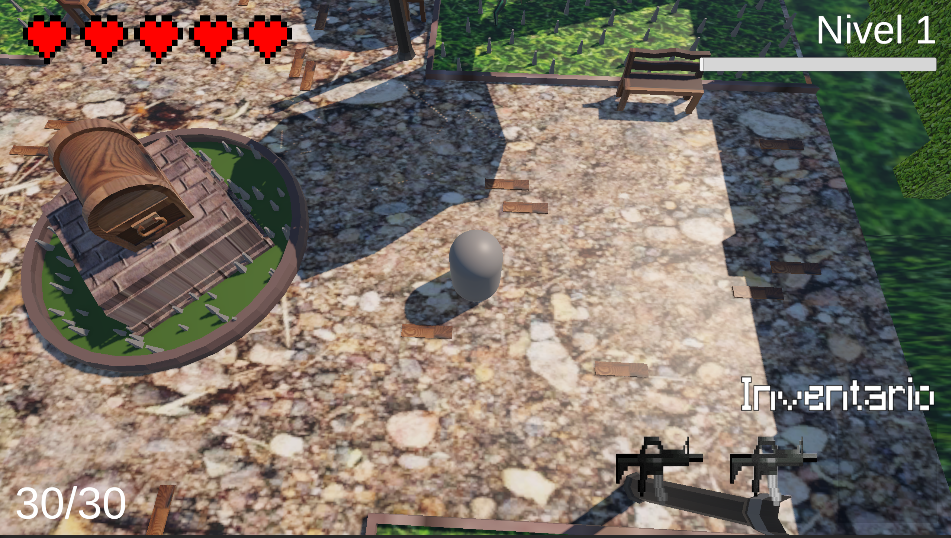

# Frontend (Capa visual del videojuego)

El término frontend no se suele usar en el desarrollo de videojuegos de la misma forma que en el desarrollo web, sin embargo hay más significados válidos adaptados, como **Capa visual**.

La capa visual del videojuego CypherCTRL está desarollado utilizando **Canvas UI** de Unity para los elementos visibles en la interfaz dentro del juego, **Sprites** e **imágenes PNG** para mostrar los íconos de los objetos obtenibles como **Items** y **TextMeshPro** para la implementación de textos de alta calidad visual en la interfaz. &#x20;

Ofrece una interfaz visual minimalista y limpia, permitiendo al jugador tomar decisiones en tiempo real de forma eficiente. Integrando los siguientes elementos.

* HUD en la parte superior izquierda representando la vida que el jugador dispone.&#x20;
* Contador de munición restante en la parte inferior izquierda.
* Inventario con tres espacios disponibles para almacenar objetos obtenibles como armas y consumibles, seleccionables con las teclas 1, 2 y 3.
* Sistema de nivelación progresiva que aumenta al derrotar enemigos.

<figure><figcaption></figcaption></figure>
